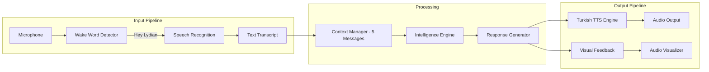

# LyDian Voice - Turkish Voice Assistant PWA

> A Progressive Web App voice assistant with wake-word detection, Turkish text-to-speech, and conversational memory.

[](https://voice.ailydian.com)
[](https://voice.ailydian.com)
[](LICENSE)

---

## Overview

LyDian Voice is a browser-native voice assistant Progressive Web App (PWA) built with Web Speech API and Web Audio API. It activates on the "Hey Lydian" wake word, processes natural language queries, and responds in Turkish using premium text-to-speech voices. The app features a 5-message conversational memory system, real-time audio visualization, and exponential backoff retry logic for robust operation.

---

## Architecture



---

## Key Features

### Voice Interaction
- **Wake-Word Activation**: "Hey Lydian" phrase detection via Web Speech API
- **Auto Re-activation**: Automatically resumes listening after each response cycle
- **5-Message Conversational Memory**: Maintains context across multiple exchanges
- **Turkish Text-to-Speech**: Premium voice selection with configurable rate, pitch, and volume

### Audio Processing
- **Real-time Audio Visualizer**: Live waveform rendering using Web Audio API AnalyserNode
- **Processing State Animations**: Visual feedback for listening, processing, and speaking states
- **Retry Logic**: Exponential backoff with 3 attempts for network resilience

### Progressive Web App
- **Installable**: Add to home screen on iOS, Android, and desktop
- **Offline Capability**: Core UI and interaction logic works without network
- **Manifest + Service Worker**: Full PWA compliance

### UI Design
- **Glassmorphism UI**: Frosted glass card design with backdrop blur
- **SVG Animations**: Smooth particle and pulse animations
- **Responsive Layout**: Optimized for mobile and desktop viewports

---

## Technology Stack

| Category | Technology |
|----------|------------|
| Core | HTML5, CSS3, Vanilla JavaScript |
| Speech Input | Web Speech API (SpeechRecognition) |
| Audio Processing | Web Audio API (AnalyserNode) |
| Text-to-Speech | Web Speech API (SpeechSynthesis) |
| Backend Functions | Vercel Serverless Functions |
| Deployment | Vercel |
| PWA | Web App Manifest + Service Worker |

---

## Getting Started

### Prerequisites

- Modern browser with Web Speech API support (Chrome, Edge recommended)
- Microphone access permission
- Node.js 20+ (for development)

### Local Development

```bash
# Clone the repository
git clone https://github.com/lydianai/voice.ailydian.com.git
cd voice.ailydian.com

# Install dependencies
npm install

# Start development server
npm run dev
```

The app will be available at `http://localhost:3000`.

### Environment Variables

```env
# Intelligence Engine API
INTELLIGENCE_API_KEY=your_key_here
INTELLIGENCE_API_URL=https://your-endpoint.com

# App Configuration
NEXT_PUBLIC_APP_URL=https://voice.ailydian.com
```

---

## Usage Guide

1. **Open the app** at [voice.ailydian.com](https://voice.ailydian.com)
2. **Grant microphone permission** when prompted
3. **Say "Hey Lydian"** to activate the assistant
4. **Speak your query** in Turkish
5. The assistant will **respond with audio and visual feedback**
6. The system **automatically re-activates** for the next query

### Voice Settings

Accessible from the settings panel:

| Setting | Range | Default |
|---------|-------|---------|
| Speech Rate | 0.5 - 2.0 | 1.0 |
| Voice Pitch | 0.5 - 2.0 | 1.0 |
| Volume | 0.0 - 1.0 | 0.9 |
| Voice | System Turkish voices | Preferred |

---

## Browser Compatibility

| Browser | Support |
|---------|---------|
| Chrome 100+ | Full |
| Edge 100+ | Full |
| Safari 15+ | Partial (TTS only) |
| Firefox | Limited |

Web Speech API support varies by browser. Chrome and Edge provide the most complete experience including wake-word detection.

---

## Project Structure

```
voice.ailydian.com/
├── index.html          # Main PWA shell
├── manifest.json       # PWA manifest
├── api/                # Vercel serverless functions
│   └── chat.js         # Intelligence engine proxy
├── app/                # Next.js pages (if applicable)
├── components/         # UI components
│   ├── visualizer.js   # Audio visualizer
│   └── controls.js     # Voice control panel
└── public/             # Static assets and icons
```

---

## Security

Audio data is processed locally in the browser. Voice queries are transmitted over HTTPS to serverless functions. No audio recordings are stored. See [SECURITY.md](SECURITY.md) for vulnerability reporting.

---

## License

Copyright (c) 2024-2026 Lydian (AiLydian). All Rights Reserved.

This software is proprietary. See [LICENSE](LICENSE) for details.

---

## Links

- **Live App**: [voice.ailydian.com](https://voice.ailydian.com)
- **Main Website**: [www.ailydian.com](https://www.ailydian.com)
- **Security Policy**: [SECURITY.md](SECURITY.md)
