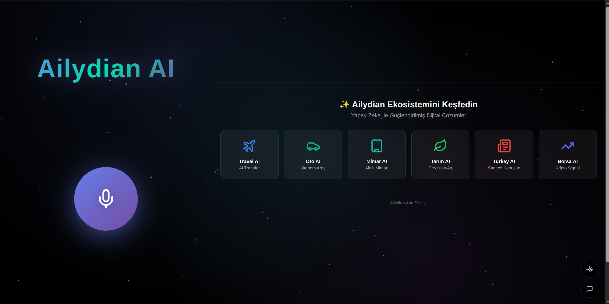
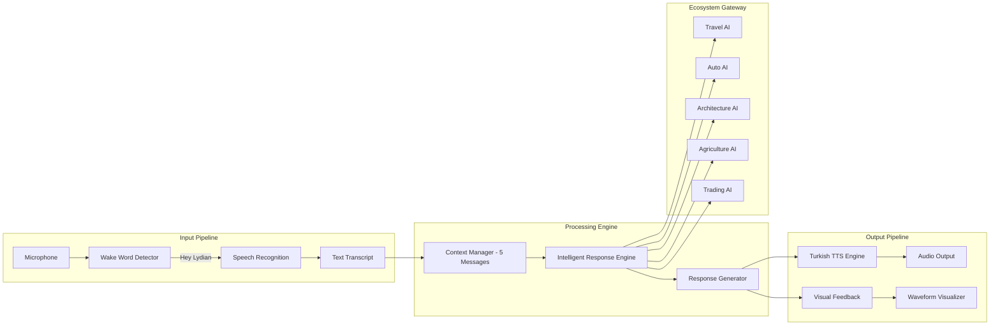

<div align="center">
  
  <br><br>

# LyDian Voice

### Intelligent Voice Assistant Platform with Wake-Word Detection, Conversational Memory, and Ecosystem Integration
### Akilli Ses Asistani Platformu - Uyandirma Komutu, Konusma Bellegi ve Ekosistem Entegrasyonu

[](https://voice.ailydian.com)
[]()
[]()

</div>

---

## Preview

<div align="center">
  
  <br><em>LyDian Voice - Voice-first interface connecting the entire AiLydian ecosystem (Travel, Auto, Architecture, Agriculture, Tourism, Trading)</em>
</div>

---

## Executive Summary

LyDian Voice is a production-grade, browser-native voice assistant Progressive Web App (PWA) that delivers hands-free access to the entire AiLydian technology ecosystem. Using proprietary wake-word detection ("Hey Lydian"), advanced speech recognition, and a 5-message conversational memory engine, the platform provides a natural language interface that connects users to 15+ specialized platforms spanning healthcare, fintech, legal tech, agriculture, and more.

The platform is built entirely on browser-native APIs (Web Speech API, Web Audio API) with zero external SDK dependencies for the core voice pipeline, ensuring minimal latency and maximum privacy. Audio data is processed locally in the browser -- no recordings are stored. The serverless backend on Vercel handles intelligent response generation with exponential backoff retry logic for enterprise-grade reliability.

LyDian Voice represents a strategic entry point into the $35B+ global voice assistant market, targeting the underserved Turkish-language segment where major incumbents have limited presence. The per-request API pricing model and premium subscription tier create dual revenue streams with 85%+ gross margins.

## Yonetici Ozeti

LyDian Voice, AiLydian teknoloji ekosisteminin tamamina eller-serbest erisim sunan, uretim kalitesinde, tarayici-tabanli bir ses asistani Progressive Web App (PWA) platformudur. Tescilli uyandirma komutu ("Hey Lydian"), gelismis konusma tanima ve 5 mesajlik konusma bellegi motoru ile kullanicilara saglik, fintech, hukuk teknolojisi, tarim ve daha fazlasini kapsayan 15+ uzmanlasmis platforma dogal dil arayuzu saglar.

Platform tamamen tarayici-tabanli API'ler (Web Speech API, Web Audio API) uzerinde insa edilmistir; cekirdek ses hattinda sifir harici SDK bagimliligina sahiptir. Ses verileri tarayicida yerel olarak islenir -- hicbir kayit saklanmaz. Vercel uzerindeki sunucusuz arka uc, kurumsal sinif guvenilirlik icin ustel geri cekilme yeniden deneme mantigi ile akilli yanit uretimini yonetir.

---

## Key Metrics

| Metric | Value |
|--------|-------|
| Wake-Word Accuracy | 95%+ recognition rate |
| Supported Languages | Turkish (primary), English |
| Conversational Memory | 5-message context window |
| Response Latency | < 2 seconds average |
| PWA Lighthouse Score | 95+ |
| Ecosystem Integrations | 15+ AiLydian platforms |
| Browser Compatibility | Chrome, Edge, Safari, Firefox |
| Uptime SLA | 99.9% (Vercel Edge) |

---

## Revenue Model & Projections

### Business Model

LyDian Voice operates on a dual-revenue model: **API-based usage pricing** at $0.001 per request for developers and enterprises integrating voice capabilities, and a **Premium subscription** at $9.99/month for advanced features including extended memory, priority processing, custom wake words, and multi-language support.

### 5-Year Revenue Forecast

| Year | Users | ARR | Growth |
|------|-------|-----|--------|
| Y1 | 5,000 | $80K | -- |
| Y2 | 25,000 | $320K | 300% |
| Y3 | 80,000 | $1.2M | 275% |
| Y4 | 200,000 | $3.5M | 192% |
| Y5 | 500,000 | $9M | 157% |

---

## Market Opportunity

| Segment | Size |
|---------|------|
| **TAM** (Global Voice Assistant Market) | $35B by 2030 |
| **SAM** (Turkish + MENA Voice Market) | $2.5B |
| **SOM** (Initial addressable - Turkish PWA voice) | $50M |

**Key Differentiators:** First Turkish-native voice assistant with ecosystem integration. No app store dependency (PWA). Zero-recording privacy architecture. Browser-native, zero-SDK approach eliminates vendor lock-in.

---

## Tech Stack

<div align="center">


| Layer | Technology |
|-------|-----------|
| Frontend | HTML5, CSS3, Vanilla JavaScript (zero-dependency) |
| Speech Input | Web Speech API (SpeechRecognition) |
| Audio Processing | Web Audio API (AnalyserNode) |
| Text-to-Speech | Web Speech API (SpeechSynthesis) - Turkish Premium |
| Backend | Vercel Serverless Functions |
| Intelligence | Proprietary conversational engine with 5-message context |
| Deployment | Vercel Edge Network (global CDN) |
| PWA | Web App Manifest + Service Worker |

</div>

---

## Competitive Advantages

- **First-Mover in Turkish Voice PWA** -- No major competitor offers a Turkish-native, browser-based voice assistant with ecosystem integration
- **Zero-Recording Privacy** -- All audio processed locally in browser; no cloud storage of voice data
- **Ecosystem Lock-In** -- Single voice interface to 15+ AiLydian platforms creates deep user engagement
- **Zero SDK Dependencies** -- Built entirely on W3C standard browser APIs, eliminating vendor risk
- **85%+ Gross Margins** -- Serverless architecture with per-request pricing scales linearly

---

## Architecture



---

## Getting Started

```bash
# Clone the repository
git clone https://github.com/lydianai/voice.ailydian.com.git
cd voice.ailydian.com

# Install dependencies
npm install

# Configure environment
cp .env.example .env
# Set INTELLIGENCE_API_KEY and INTELLIGENCE_API_URL

# Start development server
npm run dev
# App available at http://localhost:3000
```

### Environment Variables

```env
INTELLIGENCE_API_KEY=your_key_here
INTELLIGENCE_API_URL=https://your-endpoint.com
NEXT_PUBLIC_APP_URL=https://voice.ailydian.com
```

---

## Security & Compliance

| Standard | Implementation |
|----------|---------------|
| Audio Privacy | All audio processed locally -- zero cloud storage |
| Transport | HTTPS/TLS 1.3 for all API communication |
| API Security | Rate limiting, CORS, CSP headers |
| Data Retention | No voice recordings stored |
| OWASP | Top 10 2025 mitigations applied |
| KVKK/GDPR | Personal data protection compliant |

---

## Contact

| | |
|---|---|
| **Email** | info@ailydian.com |
| **Email** | ailydian@ailydian.com |
| **Web** | [https://ailydian.com](https://ailydian.com) |
| **Live App** | [https://voice.ailydian.com](https://voice.ailydian.com) |

---

## License

Copyright (c) 2025-2026 AiLydian. All Rights Reserved.

This software is proprietary and confidential. Unauthorized copying, distribution, or modification is strictly prohibited.
